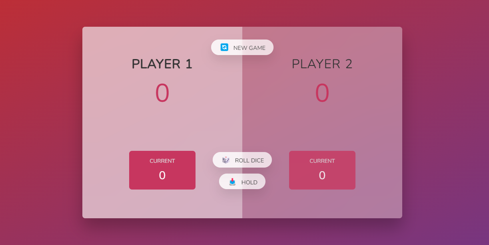

# Pig Game

A simple implementation of the popular **Pig Game** using **JavaScript**, **HTML**, and **CSS**.

 

    <a href="https://piggame-ester.netlify.app/">View Demo</a>
  

  
## Preview

## Game Rules

The game is played between two players. The goal is to be the first player to reach a score of 20 or more.

- Each player takes turns rolling a dice.
- If the dice shows a number other than 1, the number is added to the current score.
- If the dice shows 1, the current score is reset to 0, and the next player takes their turn.
- A player can choose to hold their current score, which adds it to their total score.
- The game ends when a player reaches a score of 20 or more.

## Code Structure

The code is organized into the following sections:

- **Initialization**: The `init` function sets up the game state, including the scores, current score, and active player.
- **Event Listeners**: The code sets up event listeners for the "Roll", "Hold", and "New Game" buttons.
- **Game Logic**: The `switchPlayer` function switches the active player, and the `btnRoll` and `btnHold` event listeners handle the game logic for rolling the dice and holding the score.

## Files

- `index.html`: The HTML file for the game interface.
- `style.css`: The CSS file for styling the game interface.
- `script.js`: The JavaScript file containing the game logic (this file).

## How to Play

1. Open `index.html` in a web browser.
2. Click the "New Game" button to start a new game.
3. Take turns clicking the "Roll" button to roll the dice.
4. Click the "Hold" button to hold your current score.
5. The game ends when a player reaches a score of 20 or more.

## **Contributing**

If you'd like to contribute to this application, please fork the repository and submit a pull request.
